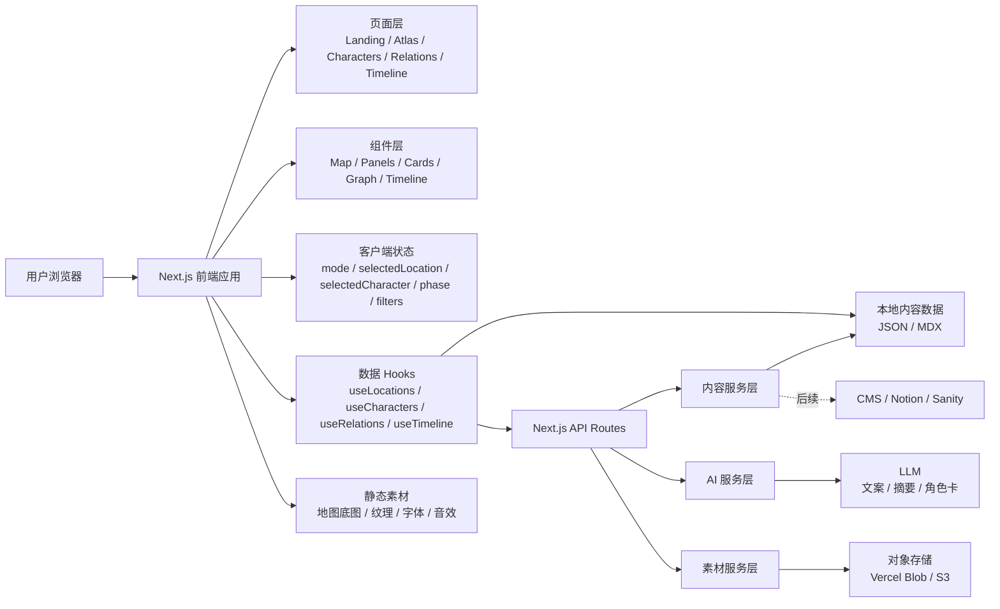
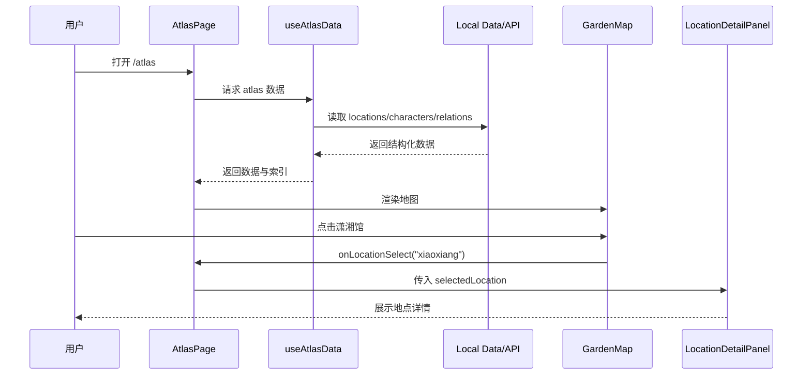
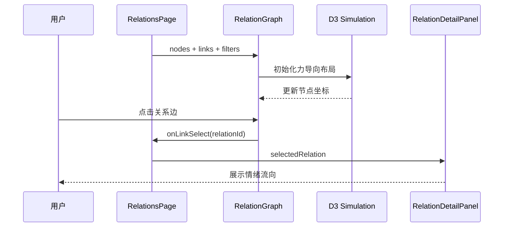
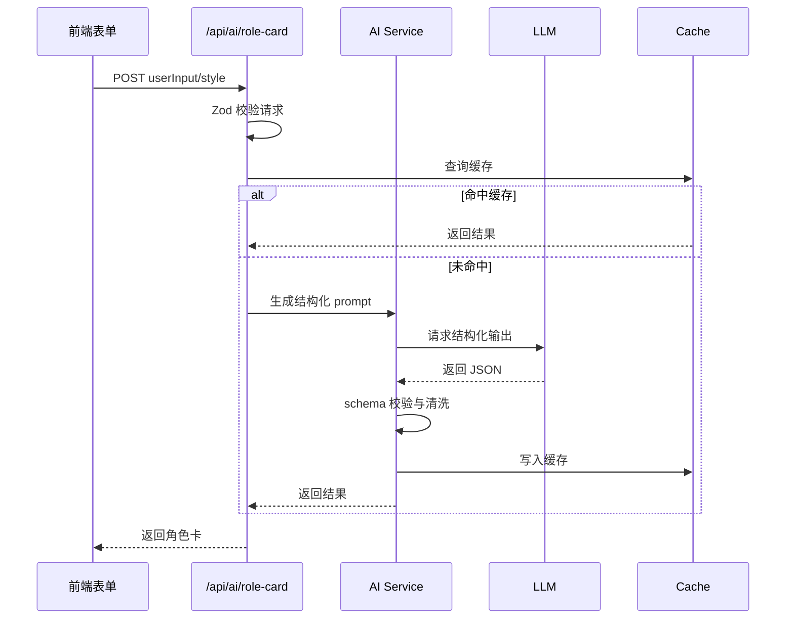

# 大观园情绪地图技术架构文档

> 项目定位：用 AI 与交互式 Web，把《红楼梦》章节中的人物出场、地点热度、命运气候和空间意象，做成一张可以播放与探索的大观园精神地图。

## 1. 文档目标

本文档定义「大观园情绪地图」的完整技术架构，重点说明：

- 前端页面、组件、交互、动画、视觉系统与状态管理如何组织。
- 后端 API、内容数据、AI 生成链路如何为前端服务。
- 前后端之间的数据契约、渲染边界和演进路径。
- MVP 与后续扩展版本的技术分层，确保第一版可以快速落地，后续可以自然升级。

项目的第一版不做传统百科，也不做复杂 3D 漫游，而是优先实现：

- 精致 2.5D SVG 大观园章节地点热力图。
- 可拖动/播放的一百二十回章节时间轴。
- 重要章节的电影感光影与兴衰渐变。
- 可点击地点详情与人物去向分析。
- 人物关系网络作为辅助阅读层，而非主体验。
- AI 辅助内容结构化与视觉素材生成。

## 2. 总体架构

### 2.1 架构原则

1. 前端优先：项目的核心价值来自视觉、交互与叙事体验，因此前端承担主要表达职责。
2. 数据驱动：地点、人物、关系、时间线、情绪数值全部以结构化数据驱动，避免写死在组件里。
3. 内容可替换：第一版使用本地 JSON / MDX，后续可平滑迁移到 CMS、数据库或 Notion。
4. AI 可插拔：AI 不直接决定前端渲染，而是作为内容生成、摘要、角色卡生成和素材生成的辅助管线。
5. 章节优先：MVP 的主叙事不是“人物关系图”，而是“每一回把哪些人物推向哪些地点，以及大观园如何随章节由亮转暗”。
6. 渐进增强：MVP 用 SVG、Framer Motion、D3 完成高级感；Three.js / R3F 作为后续增强层。

### 2.2 技术栈

| 层级 | 推荐技术 | 作用 |
| --- | --- | --- |
| Web 框架 | Next.js App Router | 路由、SSR/SSG、API Routes、部署 |
| UI 框架 | React + TypeScript | 组件化、类型安全 |
| 样式 | Tailwind CSS + CSS Variables | 主题系统、响应式、快速样式开发 |
| 动画 | Framer Motion | 页面转场、面板浮现、地图缩放、节点动效 |
| 数据可视化 | D3.js | 人物关系图、力导向图、关系筛选 |
| 地图渲染 | SVG 优先，Canvas 可选 | 情绪地图、地点热区、金线描边 |
| 复杂视觉增强 | GSAP / Lottie | 花瓣、雾气、墨迹、金线流动 |
| 后续 3D | Three.js / React Three Fiber | 3D 园林、沉浸空间 |
| 内容数据 | JSON / MDX | 地点、人物、关系、时间线、项目说明 |
| API | Next.js Route Handlers | 内容查询、AI 生成、角色卡生成 |
| AI | OpenAI API / 图像生成工具 | 文案结构化、角色卡生成、视觉素材生成 |
| 部署 | Vercel | 前后端一体部署、预览环境 |

### 2.3 前后端关系总览



核心关系：

- 前端负责 90% 的体验表达：地图、详情、关系图、时间线、动画、响应式布局。
- 后端第一版尽量轻：主要提供统一数据接口与可选 AI 接口。
- 内容数据第一版放在仓库内，方便版本管理和快速迭代。
- AI 生成结果必须经过结构化校验后进入内容层，不直接在页面中自由渲染。

## 3. 应用信息架构

### 3.1 路由规划

推荐使用 Next.js App Router。

```text
app/
  layout.tsx
  page.tsx                         Landing Page
  atlas/page.tsx                   大观园地图主页面
  characters/page.tsx              人物卡页面
  characters/[characterId]/page.tsx
  relations/page.tsx               人物关系图页面
  timeline/page.tsx                命运时间线页面
  about/page.tsx                   项目说明
  api/
    locations/route.ts
    characters/route.ts
    relations/route.ts
    timeline/route.ts
    ai/role-card/route.ts
    ai/location-copy/route.ts
```

### 3.2 页面职责

| 页面 | 职责 | 核心组件 |
| --- | --- | --- |
| Landing | 建立氛围，引导进入大观园 | IntroScene, EnterButton, PetalLayer |
| Atlas | 主地图探索，地点点击，模式切换 | GardenMap, LocationDetailPanel, ModeSwitcher, EmotionLegend |
| Characters | 人物卡片浏览、搜索、筛选 | CharacterGrid, CharacterCard, CharacterFilter |
| Character Detail | 单人物深度页 | CharacterHero, EmotionProfile, RelationList |
| Relations | D3 人物关系网络 | RelationGraph, RelationFilter, RelationDetailPanel |
| Timeline | 时间线驱动地图变化 | FateTimeline, TimelineMapPreview, EventDetail |
| About | 项目说明、方法论、技术栈 | ProjectNarrative, TechStack, Credits |

### 3.3 MVP 页面范围

第一版建议实现：

- `/`：沉浸开场页。
- `/atlas`：主地图页，包含地图、地点详情、图例、模式切换入口。
- `/characters`：人物卡列表。
- `/relations`：关系图。
- `/timeline`：命运时间线。

`/about` 可以简化为静态说明。

## 4. 前端架构

### 4.1 前端分层

```text
src/
  app/                         Next.js 路由层
  components/
    layout/                    导航、页面框架、背景层
    landing/                   开场页组件
    atlas/                     地图与地点详情组件
    characters/                人物卡组件
    relations/                 关系图组件
    timeline/                  时间线组件
    visual-effects/            花瓣、雾气、墨迹、金线等视觉层
    ui/                        通用按钮、面板、标签、Tooltip
  data/                        本地 JSON / TS 数据
  hooks/                       数据与交互 Hooks
  lib/
    data/                      数据读取、校验、索引构建
    graph/                     D3 数据转换
    motion/                    动画参数
    theme/                     色彩、情绪 token
    ai/                        AI 结果 schema 与客户端调用
  stores/                      Zustand 或轻量 Context
  types/                       全局类型定义
  styles/                      全局样式、字体、变量
```

### 4.2 前端核心设计模式

#### 4.2.1 数据驱动渲染

地图上的地点、颜色、标签、情绪值、连接人物都来自 `locations` 数据，不在 SVG 组件里硬编码文案。

推荐做法：

```tsx
<GardenMap
  locations={locations}
  selectedLocationId={selectedLocationId}
  activePhase={activePhase}
  onLocationHover={setHoveredLocationId}
  onLocationSelect={setSelectedLocationId}
/>
```

#### 4.2.2 状态上提到体验容器

`AtlasPage` 是体验容器，负责组织地图、详情卡、图例和模式切换。子组件只接收 props 和事件回调。

```text
AtlasPage
  ├─ AtlasShell
  ├─ GardenMap
  ├─ LocationDetailPanel
  ├─ EmotionLegend
  ├─ ModeSwitcher
  └─ SearchCommand
```

#### 4.2.3 复杂局部交互使用局部状态

例如 D3 关系图中的拖拽、缩放、hover 坐标，可以留在 `RelationGraph` 内部；被选中的节点、筛选类型、详情面板则上提到页面层。

#### 4.2.4 视觉效果与内容层分离

花瓣、雾气、墨迹、纹理、金线动画作为 overlay 层，不嵌入内容组件，避免视觉效果污染业务逻辑。

```text
AtlasShell
  ├─ BackgroundTextureLayer
  ├─ MistLayer
  ├─ GardenMap
  ├─ PetalLayer
  └─ ForegroundUI
```

### 4.3 全局状态设计

第一版不需要 Redux。推荐使用：

- React state：页面局部状态。
- Zustand：跨页面或复杂模式共享状态。
- URL search params：可分享的状态，如地点、人物、时间阶段。

建议状态：

```ts
type AtlasMode = "atlas" | "relations" | "timeline";
type TimelinePhase = "early" | "middle" | "late";

interface AtlasState {
  mode: AtlasMode;
  selectedLocationId: string | null;
  hoveredLocationId: string | null;
  selectedCharacterId: string | null;
  selectedRelationId: string | null;
  activePhase: TimelinePhase;
  relationFilters: RelationType[];
  searchQuery: string;
  isDetailPanelOpen: boolean;
}
```

推荐 URL 设计：

```text
/atlas?location=xiaoxiang
/relations?character=lin-daiyu&type=intimacy
/timeline?phase=late&event=raid-garden
```

这样录屏、分享和调试都更方便。

## 5. 前端页面详细设计

### 5.1 Landing Page

#### 5.1.1 目标

用户进入后 3 秒内理解项目气质：

- 不是百科。
- 不是普通关系图。
- 是一个沉浸式文学情绪空间。

#### 5.1.2 页面结构

```text
LandingPage
  ├─ ImmersiveBackdrop
  │   ├─ InkWashTexture
  │   ├─ GoldLineReveal
  │   ├─ PetalLayer
  │   └─ MistLayer
  ├─ IntroCopy
  ├─ EnterGardenButton
  └─ AudioToggle
```

#### 5.1.3 交互流程

1. 页面加载时背景纹理淡入。
2. 第一行文案出现：“大观园不是园子。”
3. 第二行文案延迟出现：“它是一座由爱、才情、权力、孤独与命运构成的情绪迷宫。”
4. 金色细线在背景中缓慢描边。
5. “进入情绪地图”按钮出现。
6. 点击按钮后：
   - 背景雾气扩散。
   - 文案淡出。
   - 路由跳转到 `/atlas`。

#### 5.1.4 动画建议

| 元素 | 动画 |
| --- | --- |
| 标题 | opacity 0 -> 1, y 16 -> 0 |
| 副文案 | 延迟 600ms 淡入 |
| 按钮 | 延迟 1200ms 淡入，hover 金边流动 |
| 花瓣 | 低频随机飘落，数量少，避免廉价 |
| 墨迹 | radial mask 扩散 |
| 金线 | stroke-dashoffset 描边 |

#### 5.1.5 可访问性

- 背景音乐默认关闭。
- 动画遵守 `prefers-reduced-motion`。
- 主按钮可键盘聚焦。
- 文案使用真实文本，不做成图片。

### 5.2 Atlas Page

#### 5.2.1 目标

这是项目的核心页面。用户可以在一张情绪园林地图上探索地点、人物、情绪与命运暗示。

#### 5.2.2 页面结构

```text
AtlasPage
  ├─ AppTopNav
  ├─ AtlasCanvasArea
  │   ├─ BackgroundTextureLayer
  │   ├─ GardenMapSvg
  │   │   ├─ MapRegionLayer
  │   │   ├─ LocationMarkerLayer
  │   │   ├─ RelationHintLayer
  │   │   └─ MapLabelLayer
  │   ├─ MapAtmosphereLayer
  │   └─ MapInteractionLayer
  ├─ FloatingControls
  │   ├─ ModeSwitcher
  │   ├─ SearchCommand
  │   └─ AudioToggle
  ├─ EmotionLegend
  ├─ LocationDetailPanel
  └─ MobileBottomSheet
```

#### 5.2.3 桌面布局

```text
 ----------------------------------------------------------
| 大观园情绪地图       Atlas Characters Relations Timeline |
|----------------------------------------------------------|
|                                                          |
|                  Interactive Garden Map                  |
|                                                          |
|      [潇湘馆]            [蘅芜苑]          [秋爽斋]       |
|                                                          |
|          [怡红院]       [诗社]        [太虚幻境]          |
|                                                          |
| [Emotion Legend]       [Mode Switcher]      [Detail Panel]|
 ----------------------------------------------------------
```

桌面端建议：

- 地图占据整个视口主体。
- 顶部导航高度 64px 左右。
- 详情面板从右侧滑出，宽度 360-420px。
- 情绪图例固定左下角。
- 模式切换固定底部中间或右上角。

#### 5.2.4 移动端布局

移动端不强行做复杂全景，使用“可缩放地图 + 底部抽屉”：

```text
 -------------------------
| Top Nav / Title         |
|-------------------------|
|                         |
|     Pinch/Drag Map      |
|                         |
|-------------------------|
| Bottom Sheet: 地点详情   |
 -------------------------
```

移动端策略：

- 地图 SVG 支持横向拖动或缩放。
- 点击地点后使用 bottom sheet，而不是右侧面板。
- 关系图页默认展示“人物列表 + 选中人物网络”，避免全图过密。
- 图例可折叠。

#### 5.2.5 GardenMapSvg 组件

职责：

- 渲染大观园情绪地图的基础形状。
- 渲染地点区域、建筑轮廓、标签、光晕。
- 处理 hover、click、keyboard focus。
- 根据时间阶段调整颜色、透明度、雾气和区域状态。

推荐 props：

```ts
interface GardenMapProps {
  locations: Location[];
  selectedLocationId: string | null;
  hoveredLocationId: string | null;
  activePhase: TimelinePhase;
  relationHighlights?: RelationHighlight[];
  onLocationHover: (id: string | null) => void;
  onLocationSelect: (id: string) => void;
}
```

内部层级：

```text
<svg>
  <defs>
    gradients
    filters
    glow filters
    texture masks
  </defs>

  <MapBaseLayer />
  <WaterAndPathLayer />
  <BuildingRegionLayer />
  <EmotionGlowLayer />
  <LocationMarkerLayer />
  <MapLabelLayer />
  <SelectedFocusRing />
</svg>
```

#### 5.2.6 地图坐标系统

为了便于响应式布局，地点 position 使用百分比坐标：

```ts
interface MapPosition {
  x: number; // 0-100
  y: number; // 0-100
}
```

SVG 内部使用固定 viewBox：

```tsx
<svg viewBox="0 0 1000 640" preserveAspectRatio="xMidYMid meet">
```

坐标转换：

```ts
const px = (location.position.x / 100) * 1000;
const py = (location.position.y / 100) * 640;
```

这样数据层保持直观，渲染层可以稳定控制视觉精度。

#### 5.2.7 地点 hover 状态

hover 时：

- 地点光晕半径增加。
- 地点标签从低透明变为高透明。
- 金色描边出现。
- 周围象征物轻微动效，例如竹影、花瓣、紫雾。
- 右下角或浮动 tooltip 展示短信息。

Tooltip 内容：

```text
潇湘馆
情绪：孤独 / 敏感 / 才情
代表人物：林黛玉
```

状态规则：

```ts
const isActive = selectedLocationId === location.id;
const isHovered = hoveredLocationId === location.id;
const isMuted = selectedLocationId && !isActive;
```

#### 5.2.8 地点点击状态

点击后：

1. 设置 `selectedLocationId`。
2. 地图中心平滑移动到该地点附近。
3. 右侧详情面板出现。
4. 相关人物在地图或面板中高亮。
5. URL 更新为 `/atlas?location=xiaoxiang`。

地图缩放不建议第一版做真实 camera 系统，可以用 Framer Motion 对地图容器做 transform：

```ts
const focusTransform = {
  x: `${50 - location.position.x}%`,
  y: `${50 - location.position.y}%`,
  scale: 1.18
};
```

注意：缩放幅度要克制，避免标签和面板错位。

#### 5.2.9 LocationDetailPanel

职责：

- 展示地点名称、英文名、代表人物、核心情绪、文学描述、情绪数值、相关人物、命运提示。
- 支持关闭、切换人物、跳转人物详情。

组件结构：

```text
LocationDetailPanel
  ├─ PanelHeader
  │   ├─ LocationName
  │   ├─ EnglishName
  │   └─ CloseButton
  ├─ SymbolRow
  ├─ CoreEmotionTags
  ├─ LiterarySummary
  ├─ EmotionBars
  ├─ RelatedCharacters
  ├─ RelatedAllusions
  └─ FateQuote
```

推荐 props：

```ts
interface LocationDetailPanelProps {
  location: Location | null;
  characters: Character[];
  onClose: () => void;
  onCharacterSelect: (characterId: string) => void;
}
```

情绪条设计：

- 使用横向 progress bar。
- bar 颜色使用地点主色。
- 背景为半透明深色。
- 数值 0-100。
- 情绪名和数值左右分布。

示例：

```text
孤独      95
[███████████████████░]
敏感      92
[██████████████████░░]
安全感    22
[████░░░░░░░░░░░░░░░]
```

#### 5.2.10 EmotionLegend

图例不是装饰，而是帮助用户理解颜色语义。

数据来源：

```ts
const emotionLegend = [
  { label: "孤独", color: "#6FA8A6", locationId: "xiaoxiang" },
  { label: "爱与依恋", color: "#C76B7A", locationId: "yihong" },
  { label: "克制", color: "#D8D2C4", locationId: "hengwu" },
  { label: "权力", color: "#8B1E1E", locationId: "rongguo" },
  { label: "宿命", color: "#8D72B8", locationId: "taixu" },
  { label: "消逝", color: "#C9A0A8", locationId: "flower-tomb" },
  { label: "才情", color: "#C8A45D", locationId: "poetry-club" }
];
```

交互：

- hover 图例项时，高亮对应地点。
- click 图例项时，筛选或聚焦对应情绪区域。
- 移动端图例默认折叠。

### 5.3 Character Page

#### 5.3.1 目标

把人物做成适合截图传播的“文学角色卡”，同时也作为关系图和地图的索引入口。

#### 5.3.2 页面结构

```text
CharactersPage
  ├─ PageHeader
  ├─ CharacterSearch
  ├─ EmotionFilter
  ├─ CharacterGrid
  │   └─ CharacterCard[]
  └─ CharacterPreviewPanel
```

#### 5.3.3 CharacterCard 结构

```text
CharacterCard
  ├─ ColorAura
  ├─ Name / EnglishName
  ├─ Residence
  ├─ SymbolChips
  ├─ CoreEmotionTags
  ├─ OneSentenceSummary
  ├─ PrimaryRelation
  └─ Actions
      ├─ 查看地图位置
      └─ 查看关系
```

推荐 props：

```ts
interface CharacterCardProps {
  character: Character;
  location?: Location;
  relations: Relation[];
  onOpenLocation: (locationId: string) => void;
  onOpenRelations: (characterId: string) => void;
}
```

#### 5.3.4 角色卡视觉规则

- 每张卡使用人物主色作为细边框和局部光晕。
- 卡片背景统一深色半透明，避免每张卡过度彩色。
- 人物名称用宋体或 serif，英文名用 Cormorant Garamond / Playfair Display。
- 卡片内不要堆百科文字，只展示情绪身份。
- 一句话必须有传播性，例如：
  - 林黛玉：她不是太脆弱，而是太早听见了世界的裂缝。
  - 薛宝钗：她不是冷漠，而是把情绪训练成了礼法。

#### 5.3.5 筛选与搜索

搜索字段：

- 中文名。
- 英文名。
- 居所。
- 情绪关键词。
- 象征物。

筛选维度：

- 情绪：孤独、克制、权力、宿命、才情、依恋。
- 地点：潇湘馆、怡红院、蘅芜苑等。
- 关系中心：宝玉、黛玉、宝钗、王熙凤等。

### 5.4 Relation Graph Page

#### 5.4.1 目标

这是项目的“高级感”来源。用户能看到人物关系不只是连线，而是情绪流动、权力结构和命运绑定。

#### 5.4.2 页面结构

```text
RelationsPage
  ├─ GraphToolbar
  │   ├─ RelationTypeFilter
  │   ├─ CharacterSearch
  │   └─ LayoutToggle
  ├─ RelationGraph
  ├─ RelationDetailPanel
  └─ GraphLegend
```

#### 5.4.3 RelationGraph 数据转换

原始数据：

```ts
interface Relation {
  id: string;
  source: string;
  target: string;
  types: RelationType[];
  strength: number;
  emotionFlow: string;
  summary: string;
}
```

D3 节点：

```ts
interface GraphNode {
  id: string;
  name: string;
  radius: number;
  color: string;
  locationId?: string;
  narrativeWeight: number;
}
```

D3 边：

```ts
interface GraphLink {
  id: string;
  source: string;
  target: string;
  strength: number;
  types: RelationType[];
  color: string;
  width: number;
}
```

转换规则：

- 节点大小 = `narrativeWeight`。
- 节点颜色 = 人物主色或所属地点主色。
- 边宽 = `strength / 20`，最小 1.5，最大 6。
- 边颜色 = 关系主类型颜色。
- 多类型关系使用渐变或虚线，不建议第一版过度复杂。

#### 5.4.4 关系类型色彩

```ts
const relationTypeColors = {
  intimacy: "#C76B7A",
  conflict: "#B84A3A",
  power: "#C8A45D",
  dependence: "#6FA8A6",
  misunderstanding: "#8D72B8",
  fate: "#D8D2C4"
};
```

中文映射：

| 类型 | 中文 | 视觉 |
| --- | --- | --- |
| intimacy | 亲密 | 胭脂红实线 |
| conflict | 冲突 | 暗红较硬折线 |
| power | 权力 | 暗金粗线 |
| dependence | 依赖 | 冷青柔线 |
| misunderstanding | 误解 | 紫色虚线 |
| fate | 命运绑定 | 冷白发光线 |

#### 5.4.5 节点交互

hover 人物节点：

- 节点扩大 8%。
- 高亮直接相连边。
- 非相关节点降透明。
- Tooltip 展示姓名、核心情绪、居所。

click 人物节点：

- 锁定选中状态。
- 打开人物关系侧栏。
- 显示该人物的所有一度关系。
- URL 更新为 `/relations?character=lin-daiyu`。

#### 5.4.6 边交互

hover 关系边：

- 边宽增加。
- 显示关系关键词。

click 关系边：

- 打开 `RelationDetailPanel`。
- 显示：
  - 双方人物。
  - 关系类型。
  - 关系强度。
  - 情绪流向。
  - 一句话总结。

示例：

```text
林黛玉 — 贾宝玉
关系关键词：知己 / 试探 / 误解 / 依赖 / 无法兑现
情绪流向：黛玉需要确认，宝玉提供温柔但无法承担承诺。
一句话：他们懂彼此，却都没有能力保护彼此。
```

#### 5.4.7 D3 与 React 边界

推荐做法：

- React 负责容器、状态、面板、筛选器。
- D3 负责 simulation、节点坐标、拖拽、缩放。
- D3 不直接管理业务状态，只通过回调通知 React。

```tsx
<RelationGraph
  nodes={nodes}
  links={links}
  selectedCharacterId={selectedCharacterId}
  selectedRelationId={selectedRelationId}
  filters={relationFilters}
  onNodeSelect={setSelectedCharacterId}
  onLinkSelect={setSelectedRelationId}
/>
```

#### 5.4.8 性能注意

- MVP 人物节点 10-20 个，SVG 足够。
- 后续如果节点超过 100 个，关系图可改 Canvas。
- D3 simulation 初始化后避免 React 每帧 setState。
- resize 使用 debounce。
- 筛选变化时再重启 simulation。

### 5.5 Timeline Page

#### 5.5.1 目标

通过时间阶段展示大观园从青春、繁盛到衰败、幻灭的情绪变化。

#### 5.5.2 页面结构

```text
TimelinePage
  ├─ TimelineMapPreview
  ├─ FateTimeline
  ├─ EventDetailPanel
  ├─ PhaseControls
  └─ EmotionCurvePanel
```

#### 5.5.3 时间阶段

```ts
type TimelinePhase = "early" | "middle" | "late";
```

| 阶段 | 中文 | 地图状态 |
| --- | --- | --- |
| early | 早期 | 花开、亮度高、连线柔和 |
| middle | 中期 | 色彩变暗、权力区域增强、冲突线增加 |
| late | 后期 | 花瓣凋落、建筑淡化、雾气加重、关系线断裂 |

#### 5.5.4 时间线事件

```ts
interface TimelineEvent {
  id: string;
  title: string;
  phase: TimelinePhase;
  order: number;
  description: string;
  affectedLocationIds: string[];
  affectedCharacterIds: string[];
  mood: "bright" | "tense" | "declining" | "illusory";
  mapEffects: MapEffect[];
}
```

#### 5.5.5 地图变化机制

地图组件接收 `activePhase` 和 `activeEvent`：

```tsx
<GardenMap
  locations={locations}
  activePhase={activePhase}
  activeEventId={activeEventId}
/>
```

阶段样式规则：

```ts
const phaseVisualState = {
  early: {
    brightness: 1,
    saturation: 1.05,
    mistOpacity: 0.18,
    petalMode: "bloom"
  },
  middle: {
    brightness: 0.82,
    saturation: 0.9,
    mistOpacity: 0.3,
    petalMode: "slow-fall"
  },
  late: {
    brightness: 0.58,
    saturation: 0.55,
    mistOpacity: 0.55,
    petalMode: "wither"
  }
};
```

#### 5.5.6 时间轴交互

- 用户拖动时间轴时，地图状态平滑插值。
- 点击事件点时，打开事件详情。
- 被影响地点出现呼吸光。
- 被影响人物在小型列表中高亮。

第一版可以用分段按钮代替连续拖动：

```text
[早期] [中期] [后期]
```

后续再升级为可拖动时间轴。

## 6. 视觉与主题系统

### 6.1 设计关键词

- 东方暗黑美学。
- 古典园林地图。
- 金线水墨。
- 命运感。
- 博物馆展览式 UI。
- 文学情绪空间。

### 6.2 CSS 变量

推荐在 `globals.css` 中定义主题 token：

```css
:root {
  --color-bg-900: #0d0b0a;
  --color-bg-800: #1a0f0f;
  --color-bg-700: #241313;

  --color-gold-500: #c8a45d;
  --color-gold-400: #d6b76d;
  --color-copper-500: #8c5a2b;

  --color-xiaoxiang: #6fa8a6;
  --color-yihong: #c76b7a;
  --color-hengwu: #d8d2c4;
  --color-daoxiang: #a8a36d;
  --color-qiushuang: #d98a4e;
  --color-taixu: #8d72b8;
  --color-rongguo: #8b1e1e;
  --color-flower-tomb: #c9a0a8;

  --panel-bg: rgba(20, 12, 10, 0.72);
  --panel-border: rgba(200, 164, 93, 0.35);
  --panel-blur: 12px;
}
```

### 6.3 字体系统

推荐：

- 中文标题：Noto Serif SC / Source Han Serif / 霞鹜文楷。
- 英文标题：Cormorant Garamond / Playfair Display / Cinzel。
- UI 与数字：Inter。

字体职责：

| 用途 | 字体 |
| --- | --- |
| 主标题 | Noto Serif SC，serif |
| 文学描述 | Noto Serif SC |
| 英文名 | Cormorant Garamond |
| 按钮和导航 | Inter |
| 数值和标签 | Inter |

### 6.4 UI 组件规则

#### 按钮

- 半透明深色底。
- 金色细边框。
- hover 时边框发光，背景略亮。
- active 时轻微缩放。

#### 面板

```css
.atlas-panel {
  background: rgba(20, 12, 10, 0.72);
  border: 1px solid rgba(200, 164, 93, 0.35);
  backdrop-filter: blur(12px);
}
```

面板风格注意：

- 不要做过度现代的蓝紫玻璃拟态。
- 不要大量圆角，建议 6-8px。
- 不要卡片套卡片。
- 文学内容要有呼吸感，UI 控件要克制。

#### 标签

- 地图标签使用金色细线连接地点。
- hover 时标签变亮。
- 标签文字不遮挡建筑轮廓。

#### 图标

使用 lucide-react：

- 搜索：`Search`
- 关闭：`X`
- 地图：`Map`
- 人物：`Users`
- 时间线：`Clock`
- 关系：`Network`
- 音频：`Volume2 / VolumeX`

### 6.5 动画系统

统一动画参数：

```ts
export const motionTokens = {
  panel: {
    initial: { opacity: 0, x: 24 },
    animate: { opacity: 1, x: 0 },
    exit: { opacity: 0, x: 24 },
    transition: { duration: 0.32, ease: [0.22, 1, 0.36, 1] }
  },
  fadeUp: {
    initial: { opacity: 0, y: 16 },
    animate: { opacity: 1, y: 0 },
    transition: { duration: 0.5 }
  }
};
```

动画克制原则：

- 所有动画服务叙事和空间感。
- 不使用过密粒子。
- 不让花瓣遮挡正文。
- 关系图拖动时禁用多余背景动画，保证性能。

## 7. 数据模型

### 7.1 Location

```ts
interface Location {
  id: string;
  name: string;
  englishName: string;
  characterIds: string[];
  color: string;
  symbols: string[];
  emotions: EmotionScore[];
  summary: string;
  quote: string;
  position: MapPosition;
  visual: LocationVisual;
  relatedChapterRefs?: ChapterRef[];
}

interface EmotionScore {
  label: string;
  value: number;
}

interface LocationVisual {
  atmosphere: "rain" | "flower" | "snow" | "grain" | "autumn" | "mist" | "power" | "wither";
  glowRadius: number;
  textureKey?: string;
}

interface ChapterRef {
  chapter: number;
  title?: string;
  note: string;
}
```

### 7.2 Character

```ts
interface Character {
  id: string;
  name: string;
  englishName: string;
  locationId?: string;
  color: string;
  symbols: string[];
  coreEmotions: string[];
  description: string;
  relationIds: string[];
  narrativeWeight: number;
  fateKeywords: string[];
  cardQuote: string;
}
```

### 7.3 Relation

```ts
type RelationType =
  | "intimacy"
  | "conflict"
  | "power"
  | "dependence"
  | "misunderstanding"
  | "fate";

interface Relation {
  id: string;
  source: string;
  target: string;
  types: RelationType[];
  strength: number;
  keywords: string[];
  emotionFlow: string;
  summary: string;
  phaseWeights?: {
    early?: number;
    middle?: number;
    late?: number;
  };
}
```

### 7.4 Timeline

```ts
interface TimelineEvent {
  id: string;
  title: string;
  phase: TimelinePhase;
  order: number;
  description: string;
  affectedLocationIds: string[];
  affectedCharacterIds: string[];
  affectedRelationIds?: string[];
  mood: "bright" | "tense" | "declining" | "illusory";
  quote?: string;
}
```

### 7.5 数据文件规划

```text
src/data/
  locations.ts
  characters.ts
  relations.ts
  timeline.ts
  emotionLegend.ts
  navigation.ts
```

第一版建议使用 `.ts` 而不是纯 `.json`，好处：

- 可以直接导出类型。
- 可以写辅助字段。
- 可以得到 TypeScript 编译时校验。

如果希望内容人员编辑，可以再提供 JSON 版本和 schema 校验。

## 8. 数据访问层

### 8.1 本地数据读取

```ts
export function getLocations(): Location[] {
  return locations;
}

export function getLocationById(id: string): Location | undefined {
  return locations.find((location) => location.id === id);
}

export function getCharactersByLocation(locationId: string): Character[] {
  return characters.filter((character) => character.locationId === locationId);
}
```

### 8.2 索引构建

为了减少组件内查找逻辑，构建索引：

```ts
interface AtlasIndex {
  locationsById: Record<string, Location>;
  charactersById: Record<string, Character>;
  relationsById: Record<string, Relation>;
  relationsByCharacterId: Record<string, Relation[]>;
}
```

### 8.3 客户端 Hooks

```ts
function useAtlasData() {
  return {
    locations,
    characters,
    relations,
    timeline,
    index
  };
}

function useSelectedLocation(locationId: string | null) {
  const { index } = useAtlasData();
  return locationId ? index.locationsById[locationId] : null;
}
```

MVP 阶段这些 hooks 可以直接读取静态数据；后续再替换为 `fetch` / SWR。

## 9. 后端架构

### 9.1 后端职责

第一版后端不承担复杂业务，而承担：

- 提供统一内容 API。
- 封装 AI 调用，避免前端暴露密钥。
- 提供结构化校验和缓存。
- 后续接入 CMS、对象存储、用户生成内容。

### 9.2 API 规划

```text
GET /api/locations
GET /api/locations/:id
GET /api/characters
GET /api/characters/:id
GET /api/relations
GET /api/relations?characterId=lin-daiyu&type=intimacy
GET /api/timeline

POST /api/ai/role-card
POST /api/ai/location-copy
POST /api/ai/emotion-summary
```

### 9.3 API 返回格式

统一响应：

```ts
interface ApiResponse<T> {
  data: T;
  meta?: {
    version: string;
    generatedAt?: string;
  };
  error?: {
    code: string;
    message: string;
  };
}
```

示例：

```json
{
  "data": {
    "id": "xiaoxiang",
    "name": "潇湘馆",
    "englishName": "Xiaoxiang Pavilion"
  },
  "meta": {
    "version": "mvp-1"
  }
}
```

### 9.4 AI 接口设计

#### 9.4.1 角色卡生成

`POST /api/ai/role-card`

请求：

```ts
interface GenerateRoleCardRequest {
  characterId?: string;
  userInput?: string;
  style: "literary" | "xiaohongshu" | "portfolio";
}
```

响应：

```ts
interface GenerateRoleCardResponse {
  title: string;
  symbols: string[];
  coreEmotions: string[];
  summary: string;
  shareCaption: string;
}
```

用途：

- 让用户生成“你像红楼梦里的谁”情绪角色卡。
- 为小红书传播生成不同风格文案。

#### 9.4.2 地点文案生成

`POST /api/ai/location-copy`

请求：

```ts
interface GenerateLocationCopyRequest {
  locationId: string;
  tone: "poetic" | "analytical" | "short";
}
```

响应：

```ts
interface GenerateLocationCopyResponse {
  summary: string;
  quote: string;
  keywords: string[];
}
```

注意：

- AI 返回内容必须进行 schema 校验。
- 生成内容建议先进入草稿，不直接覆盖正式数据。
- 公共接口需要限流，避免滥用。

### 9.5 后端服务分层

```text
src/lib/server/
  content-service.ts
  ai-service.ts
  cache-service.ts
  schema.ts
```

职责：

- `content-service`：读取地点、人物、关系、时间线。
- `ai-service`：调用 LLM，生成结构化内容。
- `cache-service`：缓存 AI 结果。
- `schema`：Zod 校验请求和响应。

### 9.6 数据校验

推荐使用 Zod：

```ts
const LocationSchema = z.object({
  id: z.string(),
  name: z.string(),
  englishName: z.string(),
  characterIds: z.array(z.string()),
  color: z.string(),
  symbols: z.array(z.string()),
  emotions: z.array(z.object({
    label: z.string(),
    value: z.number().min(0).max(100)
  })),
  summary: z.string(),
  quote: z.string(),
  position: z.object({
    x: z.number().min(0).max(100),
    y: z.number().min(0).max(100)
  })
});
```

## 10. 前后端数据流

### 10.1 地图页面数据流



### 10.2 关系图数据流



### 10.3 AI 生成数据流



## 11. 资源与素材架构

### 11.1 静态素材目录

```text
public/
  textures/
    ink-paper.webp
    dark-silk.webp
    gold-noise.webp
  maps/
    garden-base.webp
    garden-mask.svg
  symbols/
    bamboo.svg
    flower.svg
    snow.svg
    mirror.svg
  audio/
    ambient-loop.mp3
    soft-chime.mp3
  images/
    cover.webp
```

### 11.2 地图底图策略

MVP 推荐两种方式：

1. 纯 SVG 手绘风地图：可控、轻量、适合交互。
2. AI 生成底图 + SVG 热区：视觉更强，但需要对齐热区。

推荐第一版：

- 背景用 AI 生成或手工纹理。
- 建筑和区域用 SVG 画。
- 地点热区和标签完全由 SVG 控制。

### 11.3 图像生成原则

AI 图像用于：

- 封面。
- 背景纹理。
- 局部意象，如竹影、花影、紫雾、残月。

不建议用于：

- 正文文字。
- 具体交互热区。
- 需要精确点击的地图结构。

## 12. 性能架构

### 12.1 性能目标

| 指标 | 目标 |
| --- | --- |
| 首屏加载 | 2.5s 内可见核心视觉 |
| Landing 到 Atlas 转场 | 600ms 内开始响应 |
| 地点 hover | 100ms 内反馈 |
| 关系图交互 | 拖拽不卡顿 |
| 移动端 | 中端手机可流畅浏览 |

### 12.2 优化策略

- 地图 SVG 分层，避免每次状态变化重绘整个页面。
- 视觉粒子数量有限，低端设备自动减少。
- 图片使用 WebP / AVIF。
- 字体按需加载，避免引入过多字重。
- D3 simulation 与 React 渲染隔离。
- 大型视觉增强动态 import。
- 面板和详情内容懒加载。

### 12.3 降级策略

如果设备性能不足：

- 关闭花瓣粒子。
- 减少雾气层 blur。
- 关系图禁用持续力导向动画，改为静态布局。
- 地图动画从 transform 退化为 opacity。

## 13. 响应式与适配

### 13.1 断点

```ts
const breakpoints = {
  mobile: 0,
  tablet: 768,
  desktop: 1024,
  wide: 1440
};
```

### 13.2 桌面端

- 主地图完整展示。
- 右侧详情面板。
- 顶部导航完整。
- 图例常驻。
- 关系图可展示全量节点。

### 13.3 平板端

- 地图仍占主区域。
- 详情面板可覆盖右侧 40%。
- 图例可折叠。

### 13.4 手机端

- 顶部导航简化为标题 + 菜单按钮。
- 地图允许拖动。
- 详情面板改为底部抽屉。
- 人物卡单列。
- 关系图默认以选中人物为中心。

## 14. 可访问性

必须支持：

- 键盘访问地点 marker。
- 地点 marker 有 `aria-label`。
- 关系图提供列表模式替代。
- 色彩信息不只依赖颜色，也有文本标签。
- 动画可根据 `prefers-reduced-motion` 降级。
- 背景音乐默认关闭。
- 文案与背景对比度足够。

示例：

```tsx
<button
  aria-label="查看潇湘馆：林黛玉的孤独、敏感与才情"
  onClick={() => onLocationSelect("xiaoxiang")}
>
  潇湘馆
</button>
```

## 15. 测试策略

### 15.1 单元测试

测试内容：

- 数据 schema 校验。
- `getLocationById`、`getRelationsByCharacterId` 等数据函数。
- 情绪数值合法性。
- 关系 source / target 是否存在。
- 时间线影响地点是否存在。

### 15.2 组件测试

测试内容：

- 点击地点后详情面板出现。
- 搜索人物可以过滤卡片。
- 关系类型筛选有效。
- 时间阶段切换会改变地图状态。

### 15.3 E2E 测试

推荐 Playwright：

1. 打开 Landing Page。
2. 点击进入大观园。
3. 点击潇湘馆。
4. 验证详情面板包含“林黛玉”和情绪条。
5. 进入关系页。
6. 点击“黛玉 - 宝玉”关系。
7. 验证关系解释卡出现。
8. 进入时间线页。
9. 切换到后期。
10. 验证地图进入衰败视觉状态。

### 15.4 视觉回归

重点截图：

- Landing 首屏。
- Atlas 全景。
- 潇湘馆详情。
- 人物卡列表。
- 关系图。
- 后期时间线状态。

这些截图也可复用为小红书素材。

## 16. 部署架构

### 16.1 Vercel 部署

推荐使用 Vercel：

- Next.js 原生支持。
- 自动预览环境。
- API Routes 可承载轻量后端。
- 后续可接 Vercel Blob、KV、Postgres。

### 16.2 环境变量

```text
OPENAI_API_KEY=
AI_FEATURE_ENABLED=true
NEXT_PUBLIC_APP_URL=
BLOB_READ_WRITE_TOKEN=
```

注意：

- 所有 AI 密钥只存在服务端。
- 前端只能访问 `NEXT_PUBLIC_` 前缀变量。

### 16.3 构建命令

```text
pnpm install
pnpm lint
pnpm test
pnpm build
```

## 17. 安全与内容治理

### 17.1 AI 安全

- 前端不暴露 AI Key。
- AI 输入长度限制。
- AI 输出必须 schema 校验。
- 对用户生成内容进行敏感词和长度限制。
- AI 生成结果不直接进入正式内容库。

### 17.2 内容准确性

本项目偏文学阐释，不是学术注释站。仍建议：

- 对关键人物、地点、关系保留章节来源。
- 区分“文本事实”和“项目解读”。
- 在 About 页说明：本项目是情绪可视化与文学阐释，不替代原著阅读。

## 18. MVP 实施计划

### 18.1 Day 1：内容和基础工程

- 初始化 Next.js + TypeScript + Tailwind。
- 建立 `locations.ts`、`characters.ts`、`relations.ts`、`timeline.ts`。
- 建立主题 token。
- 完成基础页面路由。

### 18.2 Day 2：Landing 与 Atlas 骨架

- 完成 Landing Page。
- 完成 Atlas 页面布局。
- 完成 SVG 地图基础形状。
- 实现地点 marker hover / click。

### 18.3 Day 3：地点详情与地图动效

- 完成 `LocationDetailPanel`。
- 实现情绪条。
- 实现地图聚焦动画。
- 添加图例和视觉气氛层。

### 18.4 Day 4：人物卡

- 完成 `CharactersPage`。
- 完成人物卡和筛选搜索。
- 增加人物到地图、关系图的跳转。

### 18.5 Day 5：关系图

- 完成 D3 关系图。
- 实现节点点击、边点击、关系筛选。
- 完成关系详情面板。

### 18.6 Day 6：时间线与打磨

- 完成时间线页面。
- 实现阶段切换地图状态。
- 移动端适配。
- 录屏截图准备。

## 19. 后续扩展

### 19.1 内容扩展

- 增加章节引用。
- 增加人物情绪曲线。
- 增加地点典故和原文摘录。
- 扩展到十二钗完整人物。

### 19.2 AI 扩展

- 用户输入一段心情，生成“你进入了大观园的哪个地点”。
- 生成个人红楼梦情绪角色卡。
- 生成小红书分享文案。
- 生成不同风格的人物解读。

### 19.3 视觉扩展

- 3D 太虚幻境入口。
- React Three Fiber 轻量园林漫游。
- Lottie 判词册页翻动。
- 地图随音乐做微弱响应。

### 19.4 产品扩展

- 账号系统。
- 收藏地点和人物。
- 分享卡片生成。
- 多作品系列：庄子、尼采、加缪、苏轼、卡夫卡。

## 20. 前端验收标准

MVP 前端达到以下标准即可发布：

- Landing 首屏有强视觉记忆点。
- Atlas 页面可清晰看到至少 8 个地点。
- 每个地点 hover 有反馈，click 有详情。
- 地点详情包含人物、情绪、描述、命运提示。
- 人物页至少 8-10 张可传播角色卡。
- 关系图至少 10 个节点、10 条边，可点击边查看解释。
- 时间线至少 3 个阶段，地图视觉状态有明显变化。
- 移动端可浏览，不出现文字遮挡和布局崩坏。
- 所有核心路径可录制 40-60 秒展示视频。

## 21. 推荐首版目录结构

```text
.
├─ public/
│  ├─ textures/
│  ├─ maps/
│  ├─ symbols/
│  └─ audio/
├─ src/
│  ├─ app/
│  │  ├─ page.tsx
│  │  ├─ atlas/page.tsx
│  │  ├─ characters/page.tsx
│  │  ├─ relations/page.tsx
│  │  ├─ timeline/page.tsx
│  │  └─ api/
│  ├─ components/
│  │  ├─ atlas/
│  │  ├─ characters/
│  │  ├─ relations/
│  │  ├─ timeline/
│  │  ├─ visual-effects/
│  │  └─ ui/
│  ├─ data/
│  ├─ hooks/
│  ├─ lib/
│  ├─ stores/
│  ├─ styles/
│  └─ types/
├─ TECHNICAL_ARCHITECTURE.md
└─ README.md
```

## 22. 技术风险与接口补充

这一节专门补充项目实际开发中容易出问题的技术点。它不是额外功能，而是实现时必须提前约束的工程边界。

### 22.1 接口层最容易出的问题

#### 22.1.1 前端直接依赖原始 JSON 结构

风险：

- MVP 阶段前端直接 import `locations.ts` 很方便，但如果组件到处直接访问原始字段，后续迁移到 API、CMS 或 AI 生成内容时会很痛。
- 一旦字段名变化，例如 `characterIds` 改成 `characters`，会影响大量组件。

规避方案：

- 前端组件不直接关心数据来源，只接收页面层整理后的 view model。
- `src/lib/data` 中提供统一 selector / adapter。
- 后端 API 和本地数据都转换成同一种前端视图结构。

推荐增加：

```ts
interface LocationViewModel {
  id: string;
  displayName: string;
  englishName: string;
  color: string;
  symbols: string[];
  emotionBars: EmotionScore[];
  representativeCharacters: CharacterSummary[];
  summary: string;
  quote: string;
  mapPosition: MapPosition;
}
```

组件只使用：

```tsx
<LocationDetailPanel location={locationViewModel} />
```

不要在组件里写：

```tsx
characters.filter((item) => location.characterIds.includes(item.id))
```

这类关联逻辑应该放在 adapter 或 selector 中。

#### 22.1.2 API 返回字段不稳定

风险：

- 后端返回 `type: "亲密 / 误解 / 命运绑定"` 这种字符串，前端很难筛选。
- AI 或 CMS 输出字段可能缺失。
- 数值可能越界，例如情绪值超过 100。

规避方案：

- 所有 API 返回枚举值，而不是展示文案。
- 展示文案由前端映射。
- API 层使用 Zod 校验。
- 前端 fetch 后也可以轻量校验，至少在开发环境报错。

关系类型应该是：

```json
{
  "types": ["intimacy", "misunderstanding", "fate"]
}
```

而不是：

```json
{
  "type": "亲密 / 误解 / 命运绑定"
}
```

前端映射：

```ts
const relationTypeLabels = {
  intimacy: "亲密",
  misunderstanding: "误解",
  fate: "命运绑定"
};
```

#### 22.1.3 API 版本不清晰

风险：

- 后续补充字段或改结构时，旧页面、录屏版本、分享链接可能失效。
- 静态数据与远程 API 的结构不一致。

规避方案：

- 所有 API 响应带 `schemaVersion`。
- 数据文件也带 `contentVersion`。
- 破坏性变更时新增 adapter，不直接改组件。

推荐：

```ts
interface ApiMeta {
  schemaVersion: "1.0";
  contentVersion: string;
  generatedAt?: string;
}
```

#### 22.1.4 接口粒度过细导致页面请求太多

风险：

- Atlas 页面如果分别请求地点、人物、关系、时间线，会出现 loading 闪烁。
- Vercel Serverless 冷启动或网络抖动时体验变差。

规避方案：

- MVP 提供一个聚合接口：`GET /api/atlas`.
- 页面首屏一次拿到核心数据。
- 详情页或 AI 功能再单独请求。

推荐：

```text
GET /api/atlas
```

返回：

```ts
interface AtlasPayload {
  locations: Location[];
  characters: Character[];
  relations: Relation[];
  timeline: TimelineEvent[];
  emotionLegend: EmotionLegendItem[];
}
```

### 22.2 数据关联层风险

#### 22.2.1 id 不一致导致页面空白

风险：

- `locations.characterIds` 中写了 `lin-dai-yu`，但 characters 里是 `lin-daiyu`。
- relation 的 source / target 找不到对应人物。
- timeline 影响的 location 不存在。

规避方案：

- 写一个 `validate-content` 脚本，在开发和构建前运行。
- 检查所有外键引用。
- 检查重复 id。
- 检查情绪值范围。
- 检查地图坐标范围。

建议脚本：

```text
pnpm validate:content
```

校验内容：

```ts
function validateContent(payload: AtlasPayload) {
  assertUniqueIds(payload.locations);
  assertUniqueIds(payload.characters);
  assertUniqueIds(payload.relations);
  assertLocationCharacterRefs(payload.locations, payload.characters);
  assertRelationCharacterRefs(payload.relations, payload.characters);
  assertTimelineRefs(payload.timeline, payload);
  assertEmotionScores(payload.locations);
  assertMapPositions(payload.locations);
}
```

#### 22.2.2 文学内容和 UI 内容混在一起

风险：

- `summary` 既用于详情面板，又用于 tooltip、卡片、分享图，最后长度不可控。
- 一个字段在不同 UI 中被迫裁剪，移动端容易溢出。

规避方案：

- 区分长文案、短文案、分享文案。

推荐字段：

```ts
interface LocationCopy {
  tooltip: string;
  shortSummary: string;
  detailSummary: string;
  fateQuote: string;
  shareCaption?: string;
}
```

### 22.3 地图和 SVG 层风险

#### 22.3.1 SVG 热区和视觉区域不一致

风险：

- 用户看到一个建筑，但实际可点击区域偏移。
- AI 底图重新生成后，热区全部错位。

规避方案：

- MVP 不依赖纯图片地图做点击。
- 用 SVG 绘制关键区域和 marker。
- 如果使用 AI 底图，只作为背景，点击热区仍由 SVG 控制。
- 地点坐标统一使用 `viewBox` 坐标或百分比坐标，不混用 CSS pixel。

#### 22.3.2 地图缩放导致标签和面板错位

风险：

- 对整个 SVG 做 `scale` 后，tooltip 位置和鼠标位置不一致。
- 移动端缩放后点击点偏移。

规避方案：

- 地图聚焦动画只作用于地图视觉层，不影响固定 UI 层。
- Tooltip 使用同一个坐标转换函数计算位置。
- 移动端第一版优先使用点击 marker + bottom sheet，不做复杂 pinch zoom。

推荐抽出工具函数：

```ts
function mapPositionToViewBox(position: MapPosition) {
  return {
    x: (position.x / 100) * MAP_VIEWBOX_WIDTH,
    y: (position.y / 100) * MAP_VIEWBOX_HEIGHT
  };
}
```

#### 22.3.3 视觉效果压过内容

风险：

- 花瓣、雾气、纹理过多会降低阅读性。
- blur 和 mix-blend-mode 在低端设备上很吃性能。

规避方案：

- 所有视觉层设置 `pointer-events: none`。
- 视觉层有全局强度开关。
- 低性能设备和 `prefers-reduced-motion` 自动降级。
- 关系图页面默认降低背景动画强度。

### 22.4 D3 与 React 集成风险

#### 22.4.1 D3 直接改 DOM，React 状态不同步

风险：

- D3 手动 append SVG 元素，React 重新渲染后节点丢失或重复。
- 选中状态、筛选状态和 D3 内部状态不一致。

规避方案：

- React 负责渲染 SVG 元素，D3 只负责计算坐标；或 D3 完整接管一个 isolated ref 容器。
- 两种模式不要混用。

MVP 推荐：

- D3 负责 simulation。
- React 渲染 nodes / links。
- 坐标更新使用 `requestAnimationFrame` 和局部 state/ref，避免每 tick 触发整个页面渲染。

#### 22.4.2 simulation 每次筛选都重启导致抖动

风险：

- 用户切换筛选器时图剧烈跳动。
- 录屏观感不稳定。

规避方案：

- 保留上一次节点坐标。
- 筛选只改变 opacity / visibility，必要时轻量重热 simulation。
- 提供固定布局 fallback，用于小红书录屏和移动端。

```ts
type GraphLayoutMode = "force" | "fixed" | "radial";
```

#### 22.4.3 关系类型多选造成视觉混乱

风险：

- 一条边有多个类型时，颜色、虚线、粗细规则冲突。

规避方案：

- 每条关系设置 `primaryType`。
- `types` 表示全部语义。
- 边颜色使用 `primaryType`，详情面板展示全部类型。

```ts
interface Relation {
  primaryType: RelationType;
  types: RelationType[];
}
```

### 22.5 AI 接口风险

#### 22.5.1 AI 输出不可控

风险：

- AI 返回过长文案，破坏卡片布局。
- AI 返回不存在的人物或地点。
- AI 风格不稳定，和项目审美不一致。

规避方案：

- AI 接口只返回严格 JSON。
- 使用 schema 校验和长度裁剪。
- prompt 中明确禁止新增未定义人物 id。
- AI 结果进入草稿态，由用户确认后才写入正式数据。

推荐响应限制：

```ts
interface AiCopyLimits {
  tooltipMaxLength: 28;
  shortSummaryMaxLength: 80;
  detailSummaryMaxLength: 220;
  quoteMaxLength: 32;
}
```

#### 22.5.2 AI 接口成本和延迟

风险：

- 用户频繁点击生成角色卡，成本上升。
- Serverless 函数等待时间过长，前端体验像卡死。

规避方案：

- 公开 demo 中 AI 功能默认做成“可选增强”，不阻塞核心地图。
- 加缓存，key 由 `characterId + style + inputHash` 组成。
- 前端显示明确 loading 和取消按钮。
- 对接口做限流。

#### 22.5.3 AI 生成内容版权和准确性边界

风险：

- 用户误以为 AI 解读是原著事实。
- 生成内容可能混入未经核验的章节信息。

规避方案：

- About 页说明“本项目是文学阐释与情绪可视化”。
- AI 生成内容标记为“生成解读”。
- 章节引用只从人工维护数据中取，不由 AI 临时编造。

### 22.6 Next.js 前后端边界风险

#### 22.6.1 Server Component 和 Client Component 混乱

风险：

- 在 Server Component 中使用 `window`、D3、Framer Motion 导致构建报错。
- 大量页面被迫 `"use client"`，失去 Next.js 优势。

规避方案：

- 页面数据读取可以在 Server Component 完成。
- 交互体验组件单独声明 `"use client"`。
- D3、Framer Motion、音频、浏览器 API 只出现在 client 组件中。

推荐结构：

```text
app/atlas/page.tsx                 Server Component，读取数据
components/atlas/AtlasExperience.tsx  Client Component，处理交互
```

#### 22.6.2 静态生成和动态 AI API 混在一起

风险：

- 页面因为引用动态函数而无法静态生成。
- 构建后静态内容和动态内容缓存策略不清楚。

规避方案：

- 内容页面优先静态生成。
- AI route handler 单独动态执行。
- 不在页面 render 阶段调用 AI。

#### 22.6.3 环境变量误暴露

风险：

- 把 `OPENAI_API_KEY` 放到前端代码或 `NEXT_PUBLIC_` 中。

规避方案：

- AI 调用只存在 `/api/ai/*`。
- 前端永远只请求本项目 API。
- 代码审查时搜索 `process.env` 和 `NEXT_PUBLIC`。

### 22.7 样式和响应式风险

#### 22.7.1 中文长句溢出

风险：

- 文学文案在移动端卡片、按钮、tooltip 中溢出。
- 英文名和中文名组合后挤压布局。

规避方案：

- 所有卡片字段设置最大行数。
- 长文案进入详情页，不进入小卡片。
- 对按钮、标签、tooltip 设置 `min-width: 0`、`overflow-wrap`。

建议 CSS：

```css
.text-balance-safe {
  overflow-wrap: anywhere;
  word-break: normal;
}

.line-clamp-summary {
  display: -webkit-box;
  -webkit-line-clamp: 3;
  -webkit-box-orient: vertical;
  overflow: hidden;
}
```

#### 22.7.2 颜色高级但对比度不足

风险：

- 深红、暗金、冷白在深色背景上可能局部不可读。

规避方案：

- 文本颜色和情绪色分离。
- 情绪色用于边框、光晕、图形，不直接作为大段正文颜色。
- 给地图标签加暗色描边或背景阴影。

### 22.8 部署和缓存风险

#### 22.8.1 静态资源过大

风险：

- AI 生成背景图过大，首屏慢。
- 字体文件过多。

规避方案：

- 背景图控制在 300KB-600KB。
- 使用 WebP / AVIF。
- 字体只加载需要的字重。
- 大图延迟加载，Landing 首屏优先加载压缩纹理。

#### 22.8.2 API 缓存导致内容更新不生效

风险：

- Vercel 缓存或浏览器缓存让 JSON 更新后页面仍显示旧内容。

规避方案：

- 静态内容 API 返回 `contentVersion`。
- 构建时生成版本号。
- 如果使用 fetch，明确 `next: { revalidate: ... }`。

### 22.9 推荐新增工程脚本

```json
{
  "scripts": {
    "dev": "next dev",
    "build": "next build",
    "lint": "next lint",
    "typecheck": "tsc --noEmit",
    "validate:content": "tsx scripts/validate-content.ts",
    "test": "vitest",
    "test:e2e": "playwright test"
  }
}
```

发布前最低检查：

```text
pnpm validate:content
pnpm typecheck
pnpm lint
pnpm build
```

### 22.10 建议新增接口契约文件

为了避免前后端各写各的，建议新增：

```text
src/contracts/
  atlas.ts
  ai.ts
  api-response.ts
```

其中：

- `atlas.ts` 定义 Location、Character、Relation、Timeline 的 schema 和 type。
- `ai.ts` 定义 AI 请求和响应 schema。
- `api-response.ts` 定义统一响应格式。

原则：

> 前端类型、后端校验、测试用例共用同一份契约。

这样能显著减少接口字段漂移、空页面和运行时错误。

## 23. 总结

「大观园情绪地图」的技术核心不是把《红楼梦》资料搬到网页上，而是建立一个以结构化文学数据为底座、以前端交互为主体、以 AI 生成为增强能力的情绪可视化系统。

第一版最重要的成功标准是：

> 用户进入页面后，愿意点击、停留、截图、录屏，并且能立刻感受到：大观园不是园子，而是一座命运迷宫。

因此工程优先级应该是：

1. 精致的前端体验。
2. 稳定的数据结构。
3. 清晰的前后端契约。
4. 可控的 AI 增强。
5. 后续可扩展的内容系统。
